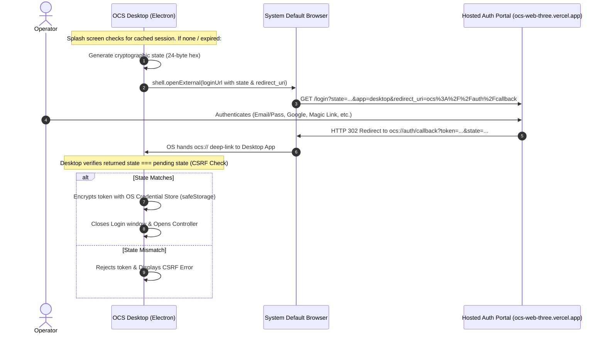

# OCS Authentication & Licensing Web-Redirect Protocol Contract (PRD v1.10 / FR-13.1–FR-13.8)

This document specifies the interface contract between the **OCS Desktop Application** and the **Hosted OCS Authentication Web Portal** (`ocs-web-three.vercel.app`).

---

## 1. Overview & Flow (FR-13.3)



---

## 2. Desktop → Web Portal Contract (`GET /login`)

When the operator clicks **"Log In via Browser"**, Desktop invokes the default system browser:

### Request Format
```
GET https://ocs-web-three.vercel.app/login?state={STATE}&app=desktop&redirect_uri={REDIRECT_URI}
```

### Query Parameters

| Parameter | Type | Required | Description |
| :--- | :--- | :--- | :--- |
| `state` | `string` | **Yes** | 48-character hex cryptographic nonce generated by Desktop for CSRF mitigation (FR-13.3 Step 4). |
| `app` | `string` | **Yes** | Client identifier (`desktop`). |
| `redirect_uri` | `string` | **Yes** | URL-encoded custom scheme callback (`ocs%3A%2F%2Fauth%2Fcallback`). |

---

## 3. Web Portal → Desktop Deep-Link Callback Contract (`ocs://auth/callback`)

Upon successful authentication and license verification, the web server redirects the browser to:

### Callback Format
```
ocs://auth/callback?token={TOKEN}&state={STATE}&email={EMAIL}&org={ORG_NAME}&tier={TIER}
```

### Query Parameters

| Parameter | Type | Required | Description |
| :--- | :--- | :--- | :--- |
| `token` | `string` | **Yes** | Session bearer token / JWT authenticating the church organization license. |
| `state` | `string` | **Yes** | The exact `state` value received in the `/login` request. |
| `email` | `string` | Optional | Operator / Church admin email address (displayed in OCS sidebar). |
| `org` / `orgName` | `string` | Optional | Name of church or organization (displayed in OCS sidebar). |
| `tier` | `string` | Optional | Licensing tier (`standard`, `pro`, `enterprise`). Default `standard`. |

---

## 4. Security & Storage (FR-13.4, FR-13.5)

1. **CSRF Validation:** Desktop strictly validates `state === pendingAuthState.state` before accepting the token.
2. **OS-Native Credential Store:** The token is encrypted using Electron's `safeStorage` (backed by macOS Keychain / Windows DPAPI) before persisting to `userData/session.enc`. Plaintext tokens are never stored.
3. **Grace Period (72h):** Valid sessions are cached locally, allowing Sunday services to operate without active internet access for up to 72 hours.
4. **Mobile Pairing Gating (FR-13.7):** Desktop only accepts companion pairing requests when authenticated. Mobile requires no separate login.
